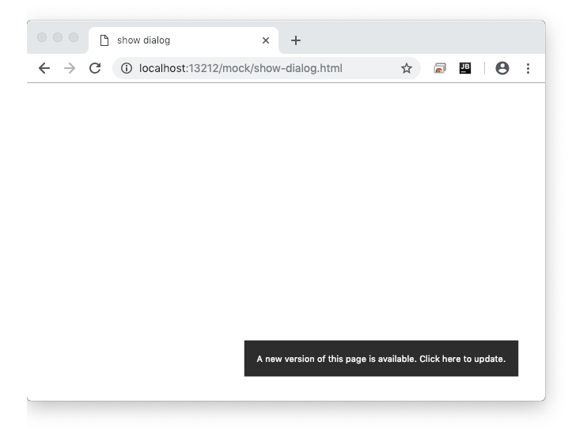

# service-worker-updatefound-refresh-dialog [](https://travis-ci.org/azu/service-worker-updatefound-refresh-dialog)

Show refresh dialog/banner when the service worker found updated.



## Install

Install with [npm](https://www.npmjs.com/):

    npm install service-worker-updatefound-refresh-dialog

Or

Import from [unpkg.com](https://unpkg.com/):

- UMD: https://unpkg.com/service-worker-updatefound-refresh-dialog/service-worker-updatefound-refresh-dialog.umd.js
- mjs: https://unpkg.com/service-worker-updatefound-refresh-dialog?module

## Usage

```html
<!DOCTYPE html>
<html lang="en">
<head>
    <meta charset="UTF-8">
    <title>Example</title>
</head>
<body>
<script src="https://unpkg.com/service-worker-updatefound-refresh-dialog/service-worker-updatefound-refresh-dialog.umd.js"></script>
<script>
    window.addEventListener('load', function() {
        navigator.serviceWorker.register('/mock/sw.js')
            .then(function(registration) {
                serviceWorkerUpdatefoundRefreshDialog.register(registration);
            });
    });
</script>
</body>
</html>
```

### Options

- `message`: Custom message
- `onClick`: onClick handler for dialog
- `forceUpdate`: force show updated UI for debug

``js
    window.addEventListener('load', function() {
        navigator.serviceWorker.register('/mock/sw.js')
            .then(function(registration) {
                serviceWorkerUpdatefoundRefreshDialog.register(registration, {
                    message: "Custom Message",
                    onClick: (registration) => {
                        if (!registration.waiting) {
                            return;
                        }
                        registration.waiting.postMessage("skipWaiting");
                    }
                });
            });
    });
``

## Style

Dialog's style use [CSS variables](https://developer.mozilla.org/en-US/docs/Web/CSS/--*).
You can overwrite it by CSS Variables.

````css
min-width: var(--sw-updatefound-refresh-dialog--min-width, 250px);
color: var(--sw-updatefound-refresh-dialog--color, #fff);
background-color: var(--sw-updatefound-refresh-dialog--background-color, #333);
text-align: var(--sw-updatefound-refresh-dialog--text-align, center);
border-radius: var(--sw-updatefound-refresh-dialog--border-radius, 2px);
padding: var(--sw-updatefound-refresh-dialog--padding, 16px);
position: text-align: var(--sw-updatefound-refresh-dialog--position, fixed);
z-index: var(--sw-updatefound-refresh-dialog--z-index, 1px);
left: var(--sw-updatefound-refresh-dialog--left, auto);
right: var(--sw-updatefound-refresh-dialog--left, 5%);
top: var(--sw-updatefound-refresh-dialog--left, auto);
bottom: var(--sw-updatefound-refresh-dialog--bottom, 30px);
````

For example, you can overwrite it by defining `--sw-updatefound-refresh-dialog--left`.

```html
<style>
    :root {
        --sw-updatefound-refresh-dialog--left: 0;
    }
</style>
```


## Changelog

See [Releases page](https://github.com/azu/service-worker-updatefound-refresh-dialog/releases).

## Running tests

Install devDependencies and Run `npm test`:

    yarn test

Interactive mode

    yarn test:dev

## Contributing

Pull requests and stars are always welcome.

For bugs and feature requests, [please create an issue](https://github.com/azu/service-worker-updatefound-refresh-dialog/issues).

1. Fork it!
2. Create your feature branch: `git checkout -b my-new-feature`
3. Commit your changes: `git commit -am 'Add some feature'`
4. Push to the branch: `git push origin my-new-feature`
5. Submit a pull request :D

## Author

- [github/azu](https://github.com/azu)
- [twitter/azu_re](https://twitter.com/azu_re)

## License

MIT © azu
